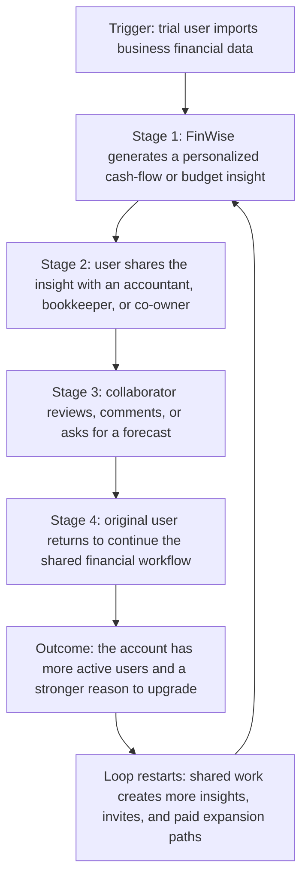

# The Bet · FinWise

> Module 1 · Ignite a PLG Motion. The growth hypothesis and where you're betting, plus the growth-loop visualization.

## Growth hypothesis

FinWise's growth problem is weak trial-to-paid conversion. The company is getting users into trials, but the reverse trial is not proving value clearly enough to make them pay.

The 13-month funnel shows 94,558 visits, 6,424 trial starts, and 128 paid conversions. Trial-to-paid conversion is 1.99%, and FinWise loses 98.01% of trial users before paid conversion. That is the biggest drop-off in the funnel.

IF FinWise prompts new trial users to import financial data, view a personalized cash-flow insight, and share that insight with an accountant, bookkeeper, or co-owner during the first week,

THEN trial-to-paid conversion will increase from about 2.0% to 2.4-2.6%,

BECAUSE users should be more willing to pay once FinWise becomes part of a real financial workflow involving their own business data,

WHICH WE'LL MEASURE with a 2-week A/B test using trial-to-paid conversion as the primary metric, first-insight completion as a secondary metric, and day-1 drop-off as the guardrail.

## The bet

I would test a collaboration loop first.

I am not testing more paid acquisition first. June 2024 had the most visits, 9,426, but the fewest trials, 321, and the fewest paid conversions, 6. More traffic will not fix a trial that converts at about 2%.

I am also not testing a referral loop yet because paid retention is only 40% after one year. Referral asks happy users to invite others. FinWise has not earned enough of those users yet.

Collaboration is the better first bet. Small-business finance usually includes an owner, accountant, bookkeeper, or co-owner. If a trial user shares a cash-flow insight with one of those people, FinWise can move from a solo dashboard to a shared operating habit.

## Growth loop

