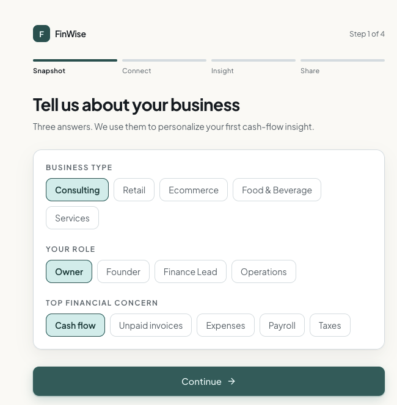
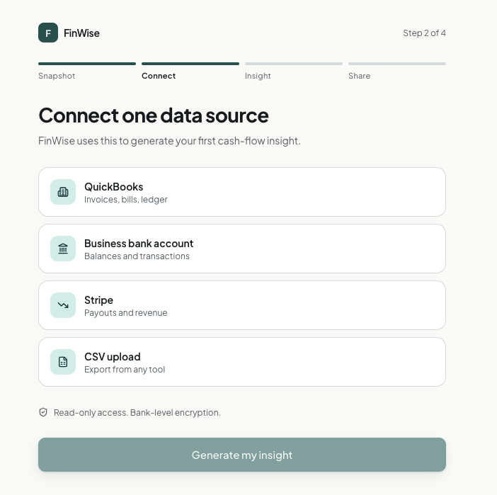
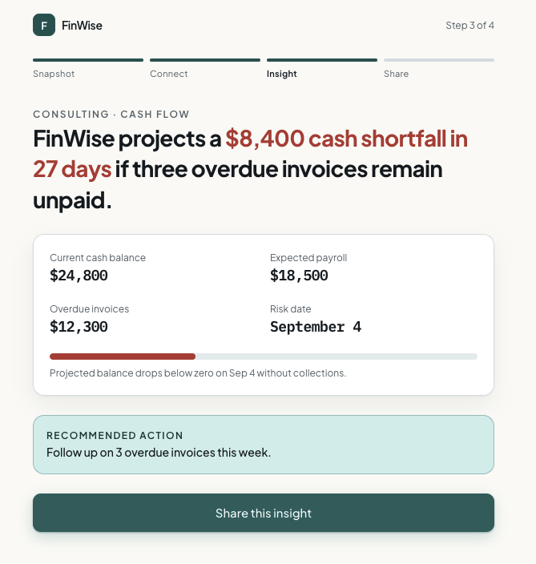
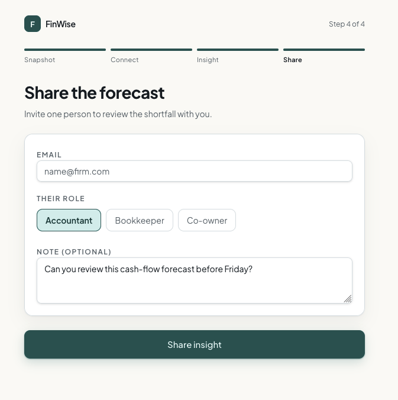
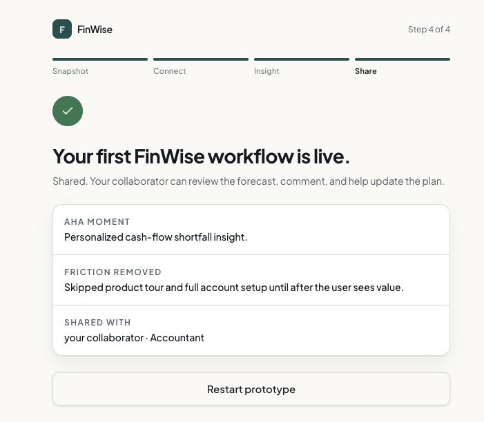

# The Solution · FinWise

> Module 2 · Acquisition & Activation. The onboarding solution and the Aha moment that makes value land.

## Aha moment

FinWise's Aha moment is when a trial user sees a specific cash-flow risk or opportunity generated from their own business data, then shares that insight with an accountant, bookkeeper, or co-owner.

The moment is not account creation, a dashboard view, or a feature tour. The moment is when FinWise turns the user's own financial data into a useful answer: for example, "You may be short $8,400 in 27 days if three overdue invoices remain unpaid."

## Onboarding prototype

Prototype artifact:

- Screenshots: `02-solution/screenshots/`
- Lovable link: https://aha-flow-fast.lovable.app
- Onboarding prompt template: [Module2 Onboarding Prompt Template](module2-onboarding-prompt-template.md)

The prototype uses a four-screen path from sign-up to Aha:

| Screen | Job | User action |
| --- | --- | --- |
| Business Snapshot | Capture only enough context to personalize the first insight. | Choose business type, role, and top financial concern. |
| Connect Financial Data | Get one real or simulated financial source into FinWise. | Connect QuickBooks, a bank account, Stripe, or a CSV. |
| First Cash-Flow Insight | Deliver the Aha moment with one specific forecast or warning. | Review the personalized insight. |
| Share Insight | Turn the insight into a shared finance workflow. | Invite an accountant, bookkeeper, or co-owner. |

The Aha moment occurs on the First Cash-Flow Insight screen. This is where FinWise stops feeling like setup and starts feeling like a working finance tool.

## Why this activates

This flow pushes a trial user to one useful answer before asking them to explore the product. The activation signal is sharing the cash-flow insight with an accountant, bookkeeper, or co-owner. That should predict retention better than a passive dashboard view because the user now has a reason to return: comments, forecast updates, invoice follow-up, and collaborator feedback.

I removed the product tour and full account setup before the first insight. My hypothesis is that trial users do not need to understand every FinWise feature before they see value. They need one useful answer from their own data as quickly as possible. A short personalization step helps only if it changes the first insight; otherwise it should be cut.
