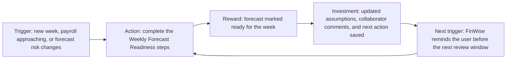
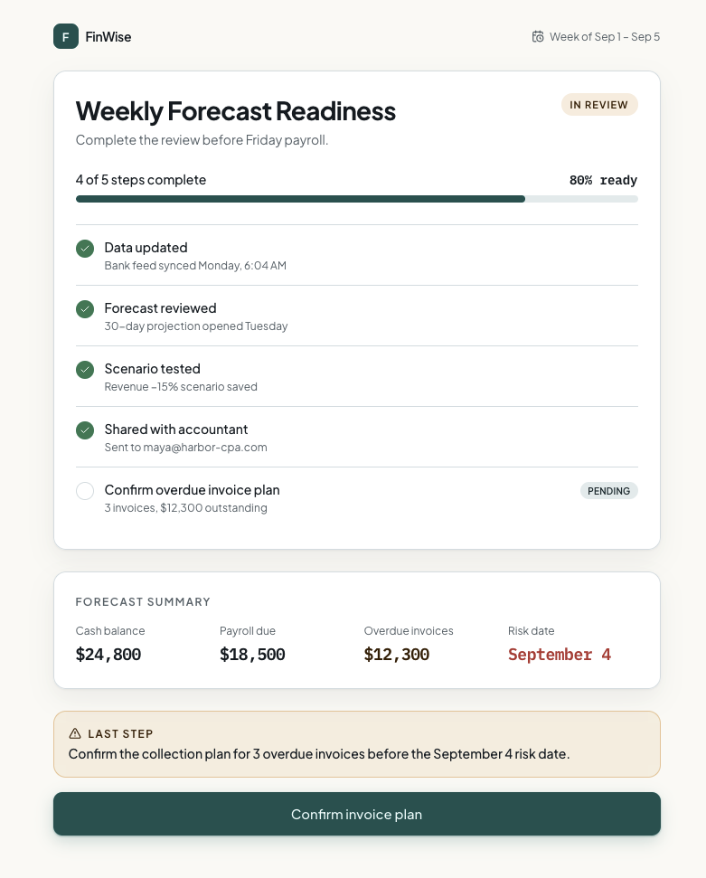

# The Mechanic · FinWise

> Module 3 · Retention & Engagement. The engagement mechanic that builds the habit loop, with rationale and a wireframe.

## The mechanic

The mechanic is **Weekly Forecast Readiness**, a progress bar that turns the first cash-flow insight into a recurring review workflow.

The behavior to reinforce is not opening FinWise. The behavior is reviewing a cash-flow forecast, testing one scenario, sharing it with an accountant, bookkeeper, or co-owner, and closing the next financial action.

The natural cadence is weekly. Small-business owners do not need a daily cash-flow game, but they do need a regular check before payroll, invoice follow-up, and major expenses.

The progress bar has five steps:

| Step | User action | Why it matters |
| --- | --- | --- |
| Update data | Refresh transactions or use the latest synced data. | Keeps the forecast tied to the business. |
| Review forecast | Check cash balance, payroll, invoices, and risk date. | Repeats the Aha moment from Module 2. |
| Test scenario | Move one revenue or expense assumption. | Helps the user understand what changes the forecast. |
| Share forecast | Send the forecast to a collaborator. | Keeps the collaboration loop alive. |
| Confirm action | Mark the invoice, payroll, or expense action that will reduce risk. | Turns the forecast into a business habit. |

Habit loop:

## Rationale

The churn diagnosis is value-related more than price-related. A user who gets one useful forecast but does not build repeat financial-modeling usage has little reason to keep paying a year later. The signal to watch is session duration alongside modeling usage: if sessions get shorter and forecast/modeling events do not recur, FinWise is not becoming part of the owner's weekly operating rhythm.

A progress bar is the best fit because the behavior has a clear completion state. The user is trying to make the forecast ready enough to trust for the week. Each step moves the owner closer to that outcome.

A streak would be weaker. Cash-flow review is not naturally daily, and punishing a missed day would feel fake. A leaderboard would be worse because small-business cash management is private and context-specific. Comparing an owner against other businesses would feel tone-deaf.

Weekly Forecast Readiness taps progress and control. The owner sees what is left before the forecast is useful: refresh the data, check the risk, test a scenario, share it, and confirm the action. Losing progress would feel like an unfinished finance review, not a lost badge. That is the right kind of pressure for FinWise.

This should improve retention before the paywall because it gives users a reason to come back before they have decided to buy. The user returns to keep the forecast current, get collaborator input, and close the action tied to cash-flow risk.

## Wireframe

Live mock-up: https://preview--aha-flow-fast.lovable.app/readiness

Concept wireframe: [weekly-forecast-readiness-wireframe.svg](weekly-forecast-readiness-wireframe.svg)

One-sentence summary: Weekly Forecast Readiness reinforces the weekly habit of reviewing and sharing a cash-flow forecast by showing progress toward a forecast that is ready for the next payroll, invoice, or expense decision.
