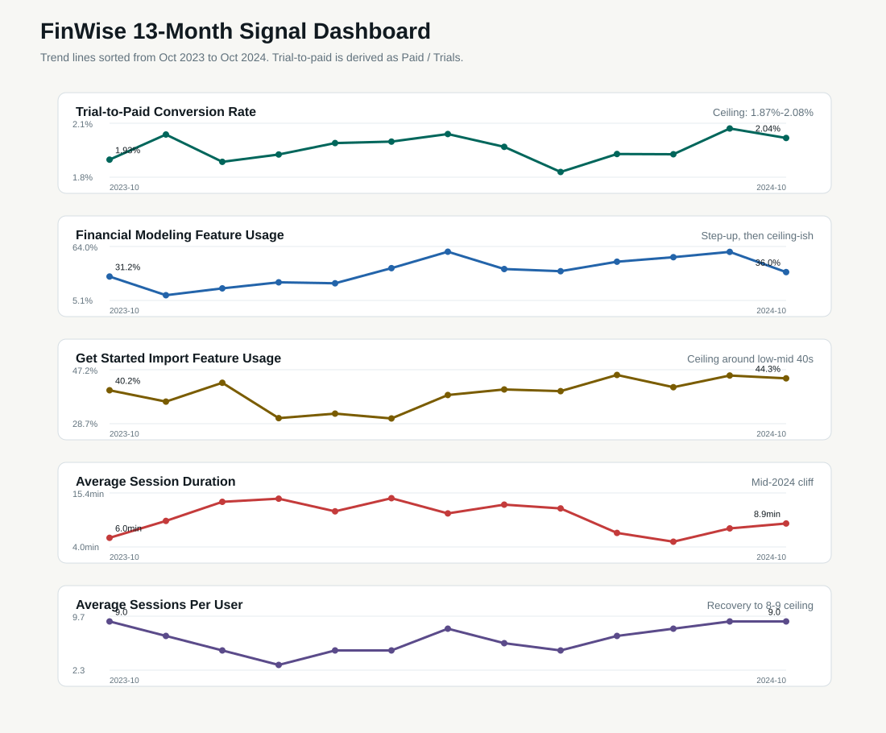
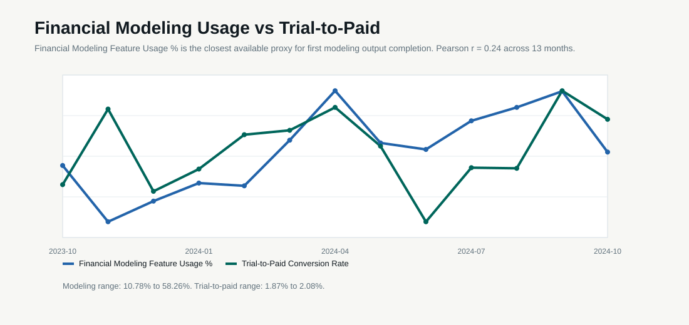

# The Signals · FinWise

> Module 4 · Data & Analytics. The data pattern you found and the indicators you'll steer by.

## The data pattern

FinWise's headline problem is weak growth, but the data points to a value problem before it points to an acquisition problem.

The 13-month funnel shows 94,558 visits, 6,424 trial starts, and 128 paid conversions. Visit-to-trial conversion is 6.79%, trial-to-paid conversion is 1.99%, and visit-to-paid conversion is 0.135%. The biggest loss is between trial start and paid conversion: 98.01% of trial users do not become paid customers.

| KPI | Result |
| --- | --- |
| Total visits | 94,558 |
| Total trials | 6,424 |
| Total paid conversions | 128 |
| Visit-to-trial conversion | 6.79% |
| Trial-to-paid conversion | 1.99% |
| Visit-to-paid conversion | 0.135% |
| Best paid/revenue month | 2024-03: 13 paid, $1,015,625 |
| Worst paid/revenue month | 2024-06: 6 paid, $468,750 |
| Best visit-to-paid month | 2024-07: 0.220% |
| Worst visit-to-paid month | 2024-06: 0.064% |

Three patterns from the funnel:

1. Trial-to-paid conversion is stuck near 2% every month. The range is narrow: 1.87% to 2.08%.
2. Website traffic does not translate cleanly into trials or paid customers. June 2024 had the most visits, 9,426, but produced the fewest trials, 321, and fewest paid conversions, 6.
3. Revenue moves directly with paid conversions. March 2024 had the highest paid conversions, 13, and highest revenue, $1,015,625. June had the lowest paid conversions, 6, and lowest revenue, $468,750.

Paid retention makes the same point after conversion. One-year paid retention is roughly 40%, which means about 60% of paid customers churn within a year. That does not look like a traffic problem. It looks like too few users build a repeated financial workflow around FinWise.

The diagnostic cut is session duration paired with financial-modeling usage. In the monthly data, trial-to-paid conversion stays almost flat while modeling usage, import usage, session duration, and sessions per user move around. That means no single engagement metric explains conversion by itself.

## Aim Move Prove

Pre-work from Module 1: FinWise's biggest growth problem is weak trial-to-paid conversion. The biggest funnel drop-off is from Trials Started to Paid Conversions: 6,424 trial starts produced only 128 paid conversions, a 98.01% loss.

That drop-off maps most cleanly to the Revenue stage because the measured event is paid conversion. Strategically, I would still treat it as an Activation problem feeding a Revenue problem, because the reverse trial has to prove enough value before the user pays.

| Layer | Metric | Why |
| --- | --- | --- |
| Aim: North Star | Number of trial users who import financial data and reach their first modeling output | This is the first behavior that proves FinWise has shown the user value from their own business data. |
| Move: Leading 1 | Financial data import completion rate among trial users | Users cannot reach a credible cash-flow model until FinWise has their financial data, so this attacks the M1 trial-to-paid drop-off at the first activation step. |
| Move: Leading 2 | First modeling output completion rate within 24 hours | This measures whether users actually reach the Aha behavior early enough to matter, not just how fast the already-motivated users move. |
| Prove: Lagging | Trial-to-paid conversion rate | This confirms whether faster first value improves the business outcome that failed in Module 1, moving conversion from about 2.0% toward 2.4-2.6%. |

## Leading indicators

The leading indicators should measure whether a user reaches value, repeats value, and brings another person into the workflow.

| Signal | Metric type | Why it matters |
| --- | --- | --- |
| First forecast completion rate | Activation rate | Shows whether trial users reach the first useful cash-flow forecast. |
| First forecast completion within 24 hours | Activation rate | Shows whether enough trial users reach the Aha behavior early in the trial. |
| Time to first forecast | Time to value | Diagnostic metric for speed among users who complete the forecast. |
| Forecast share rate | Feature engagement rate | Captures the collaboration behavior that should predict retention. |
| Weekly Forecast Readiness completion rate | Feature engagement rate | Shows whether the Module 3 mechanic creates a repeated weekly habit. |
| Scenario test rate | Feature engagement rate | Shows whether users trust FinWise enough to model business changes. |
| Collaborator comment or review rate | Feature engagement rate | Shows whether the shared workflow becomes active, not just invited. |
| Day-1 onboarding drop-off | Drop-off rate | Guardrail for whether the activation path adds too much friction. |

Engagement Weighted Score:

| Dimension | Metric | Weight |
| --- | --- | ---: |
| Depth | Weekly Forecast Readiness completion rate | 40% |
| Breadth | Forecast shared or collaborator comment added | 30% |
| Frequency | Accounts completing at least one forecast review per week | 30% |

Formula:

```text
Engagement Weighted Score =
0.40(readiness completion rate)
+ 0.30(collaboration activity rate)
+ 0.30(weekly forecast review frequency)
```

This score should move before paid conversion and renewal move. If it does not move, the mechanic is probably cosmetic.

## Signal diagnosis

Dashboard artifact:



Pattern classification:

| Metric | Pattern | What the data shows |
| --- | --- | --- |
| Trial-to-Paid Conversion Rate | Ceiling | It stays between 1.87% and 2.08% for all 13 months, even while visits and trial volume move. |
| Financial Modeling Feature Usage % | Ceiling, but messy | It rises from 10.78% in November 2023 to the high 50s in April and September 2024, then drops to 36.04% in October. Usage improves, but it does not settle into a clean plateau. |
| Get Started Import Feature Usage % | Ceiling | It moves mostly between the low 30s and mid 40s, with a high of 45.42%. The import step does not break past the mid-40s. |
| Average Session Duration | Cliff | It peaks at 14.26 minutes in March 2024, then drops sharply by July and August, bottoming at 5.14 minutes. |
| Average Sessions Per User | Does not fit cleanly; recovery to ceiling | It falls from 9 sessions in October 2023 to 3 in January 2024, then recovers to 8-9 by August through October 2024. It is not a slow leak because it recovers, and not a pure ceiling because the first half falls hard. |

The most surprising pattern is that modeling usage improves a lot, but trial-to-paid conversion does not. That challenges a simple "more modeling usage equals more conversion" story. The product may be getting more users to try modeling, but not enough of them are reaching a strong, timely, trusted output that makes payment feel necessary.

Correlation check:



The exact Exercise 1 leading indicator, first modeling output completion within 24 hours, is not present in the dataset. I used Financial Modeling Feature Usage % as the closest available proxy.

| Metric tested against Trial-to-Paid Conversion Rate | Pearson correlation | Read |
| --- | ---: | --- |
| Get Started Import Feature Usage % | -0.05 | No meaningful correlation in the monthly data. |
| Financial Modeling Feature Usage % | 0.25 | Weak positive correlation, not strong enough to prove the hypothesis. |
| Average Session Duration | -0.08 | No useful relationship. |
| Average Sessions Per User | 0.41 | Moderate positive relationship, but this is less specific than reaching the modeling output. |

The data confirms the broad Module 1 hypothesis but sharpens it. FinWise should not only push users to import data. Import completion is necessary, but monthly import usage does not correlate with conversion. The stronger experiment should get trial users to a completed first modeling output quickly, then connect that output to a collaborative action. That keeps the strategy focused on the trial-to-paid drop-off without mistaking setup activity for value.

Pressure-test of Exercise 1: the data supports the hypothesis that FinWise's biggest problem is that trial users do not reach a clear Aha moment early enough. The strongest data point is that 6,424 trials produced only 128 paid conversions, a 1.99% trial-to-paid rate. Even when trial volume changes, paid conversion stays almost flat near 2%, which suggests FinWise is not getting materially better at turning trial users into committed users. If acquisition quality were the main issue, I would expect bigger month-to-month movement. Instead, the funnel behaves like the trial experience has a hard ceiling.

## Lagging indicators

The lagging indicators are the business outcomes FinWise ultimately needs to improve.

| Outcome | Metric | Current baseline |
| --- | --- | --- |
| Trial monetization | Trial-to-paid conversion rate | 1.99%, about 2% |
| End-to-end funnel conversion | Visit-to-paid conversion rate | 0.135% |
| Paid customer retention | One-year paid retention | 40% |
| Paid customer churn | One-year churn | 60% |
| Revenue durability | Net dollar retention rate | Needs instrumentation |
| Churned revenue | Churned revenue | Needs instrumentation |

The first readout should not be ARR. ARR will lag too far behind the onboarding and engagement changes. FinWise should watch first forecast completion, forecast sharing, and weekly forecast readiness before judging whether the strategy can move trial-to-paid conversion and one-year retention.
